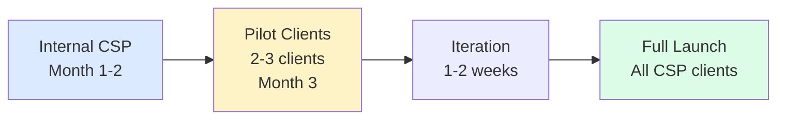
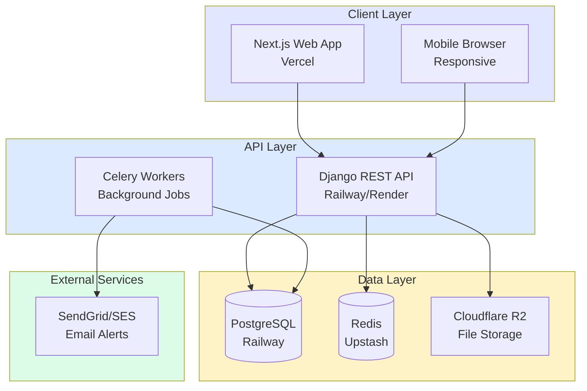

# UAE CSP-ERP MVP - Confirmed Decisions & Sprint Plan

**Date**: February 7, 2026  
**Status**: ✅ APPROVED - Ready for Development

---

## 📋 Executive Summary

Based on your responses, here's your finalized MVP strategy:

**Timeline**: 5-6 months (includes CRM + Sales cycle)  
**Team**: 3-5 developers  
**Budget**: ~$30K-80K (team) + $500/month (infrastructure)  
**Launch**: Internal CSP → 2-3 Pilot Clients → Full Rollout

---

## ✅ CONFIRMED DECISIONS

### 1. Technology Stack

| Layer | Technology | Rationale |
|-------|------------|-----------|
| **Backend** | **Django 5.0 (Python)** | Built-in admin panel, superior for financial calculations, faster MVP development |
| **Frontend** | **Next.js 14 (React)** | Modern SaaS standard, excellent DX, server components |
| **Database** | **PostgreSQL 15+** | ACID compliance for financial data, row-level security for multi-tenancy |
| **Mobile** | **Web-responsive** (Phase 1-2) | Saves 4-6 weeks, native Flutter app in Phase 3+ if needed |
| **File Storage** | **Cloudflare R2** | Cheaper than S3 (~$5/month), S3-compatible API |
| **Hosting** | **Vercel** (frontend) + **Railway/Render** (backend) | Cost-effective for MVP ($50-85/month total) |

---

### 2. MVP Scope (Phase 1)

#### ✅ INCLUDED Features

1. **Multi-Tenant Infrastructure**
   - User auth with RBAC (Super Admin, Manager, PRO, Accountant, Client roles)
   - Organization isolation (PostgreSQL row-level security)
   - Audit logging for all financial transactions

2. **Entity Management (Lite)**
   - CRUD for client companies
   - Basic document upload (Trade License, MOA, passports)
   - Expiry date tracking
   - Email alerts (T-90, T-60, T-30 days)
   - **Manual entry only** (no bulk import tool)

3. **Trust-Based Wallet System** 🎯 (Core Feature)
   - Double-entry ledger per client
   - Manual top-ups (back office records payments)
   - "Red Alert" warning gate (blocks PRO tasks if insufficient funds)
   - VAT toggle (Service Fee 5% vs Government Fee 0%)
   - Transaction history with full audit trail
   - Wallet statement PDF export

4. **Project & Task Management (Minimal)**
   - Create projects per client
   - Add tasks manually (no templates yet)
   - Assign to PRO/back office
   - Mark complete with receipt upload
   - Link wallet debits to tasks

5. **Basic Reporting**
   - Dashboard widgets (financial overview, expiry alerts, project status)
   - Excel exports

6. **CRM (Full Scope)** 🆕
   - Leads, contacts, opportunities
   - Pipeline Kanban (Lead → Quote Sent → Negotiation → Won/Lost)
   - Account management: contact history, notes, activities

7. **Sales Quotation**
   - Formal quotes with line items, VAT
   - PDF export, email to client, accept/reject workflow

8. **Sales Order**
   - Convert accepted quote to order
   - Auto-create project on order confirmation

9. **Sales Invoice**
   - Formal invoices with line items, VAT
   - PDF export; invoice payment credits wallet

**Flow**: Lead → Quote → Order → Invoice → Payment → Project

**MVP Timeline**: 5–6 months (was 3–4 months; extended for CRM + Sales)

#### ❌ EXCLUDED (Future Phases)

- ❌ Bulk client import → Manually enter first 10-20 clients
- ❌ PRO mobile native app → Web-responsive only
- ❌ Workflow template builder → Phase 2
- ❌ Payment gateway integration → Phase 3
- ❌ Bulk receipt splitter → Phase 3
- ❌ Documents App (unified filing, archiving, preview) → Phase 3.5
- ❌ UBO mapping tool → Phase 6

---

### 3. Government API Integration Strategy

**Parallel Research Model**:
- 80% of team: Build MVP with manual data entry (no API dependencies)
- 20% allocation (1 developer part-time): Research MOHRE/DED/GDRFA API partnerships
  - Document feasibility, costs, partnership requirements
  - Report findings by end of Phase 1
- **MVP Assumption**: All government data entered manually (doesn't block launch)

---

### 4. Go-Live Strategy

**Phased Rollout**:



1. **Internal CSP Staff** (Weeks 1-8)
   - Onboard back-office team
   - Test with 5-10 real entities
   - Iron out critical bugs

2. **Pilot Clients** (Weeks 9-12)
   - 2-3 friendly clients with simple structures
   - Validate wallet pre-funding model
   - Gather feedback on "Red Alert" effectiveness

3. **Iteration** (Weeks 13-14)
   - Fix critical issues
   - UI/UX refinements

4. **Full Launch** (Post-MVP)
   - Onboard all CSP clients
   - Marketing for client self-service portal (Phase 5)

---

### 5. Data Migration

**Fresh Start Approach**:
- ✅ No historical data import
- ✅ Start with new clients only
- ✅ Gradually add existing clients as you work on them
- ✅ Manually enter first 10-20 entities (quality over speed)

**Rationale**: Avoids 2-3 weeks of data cleaning. Validates system with clean data first.

---

## 🗓️ SPRINT PLAN (10 Sprints x 2 Weeks = 20 Weeks)

*Extended from 16 to 20 weeks for CRM + Sales cycle.*

### Sprint 1-2: Foundation (Weeks 1-4)

**Goal**: Developers can log in and see empty dashboard

**Backend Tasks**:
- [ ] Django 5.0 project setup + Django REST Framework
- [ ] PostgreSQL schema design (all tables)
- [ ] User authentication (Django AllAuth or JWT)
- [ ] Multi-tenant middleware (organization isolation)
- [ ] Audit logging model + middleware
- [ ] Celery setup for cron jobs

**Frontend Tasks**:
- [ ] Next.js 14 project setup (App Router)
- [ ] TailwindCSS + Shadcn/ui installation
- [ ] Authentication flow (login/logout)
- [ ] Dashboard shell with sidebar navigation
- [ ] API client setup (axios or fetch)

**DevOps Tasks**:
- [ ] GitHub repository + branch protection
- [ ] Railway/Render PostgreSQL provisioning
- [ ] Vercel project setup
- [ ] Cloudflare R2 bucket creation
- [ ] CI/CD pipeline (GitHub Actions)
- [ ] Environment variables management

**Definition of Done**:
- User can register, log in, see dashboard
- Database schema deployed
- CI/CD pipeline runs tests on every PR

---

### Sprint 3-4: Entity Management (Weeks 5-8)

**Goal**: Can manage client entities + receive expiry alerts

**Backend Tasks**:
- [ ] Entity CRUD API endpoints
- [ ] Document upload API (Cloudflare R2 integration)
- [ ] Expiry alert cron job (Celery task)
- [ ] Email service integration (SendGrid/SES)
- [ ] Search/filter API (by jurisdiction, status, expiry)

**Frontend Tasks**:
- [ ] Entity list table (TanStack Table)
- [ ] Create/edit entity forms
- [ ] Document upload component (drag-drop)
- [ ] Entity detail page
- [ ] Expiry alerts dashboard widget
- [ ] Search/filter UI

**Testing**:
- [ ] Unit tests for entity CRUD
- [ ] Test expiry alert job (mock email)
- [ ] Manual testing: Upload 5 entities with documents

**Definition of Done**:
- 10 test entities created with documents
- Expiry alert email received for entity expiring in 30 days
- Search/filter working

---

### Sprint 5-6: Wallet System 🎯 (Weeks 9-12) **CRITICAL**

**Goal**: Full financial tracking operational with "Red Alert" warning

**Backend Tasks**:
- [ ] ClientWallet + WalletTransaction models (double-entry logic)
- [ ] Atomic credit/debit methods with row-level locking
- [ ] Top-up API endpoint
- [ ] Transaction history API (paginated)
- [ ] Wallet statement PDF generator (ReportLab or WeasyPrint)
- [ ] VAT calculation logic (Service Fee vs Government Fee)
- [ ] "Red Alert" validation endpoint (check balance before task assignment)

**Frontend Tasks**:
- [ ] Wallet overview page (all clients)
- [ ] Manual top-up form
- [ ] Transaction history table (per client)
- [ ] Wallet balance widget (dashboard)
- [ ] "Red Alert" warning modal component
- [ ] VAT toggle UI (dropdown on transaction entry)
- [ ] Wallet statement download button

**Testing**:
- [ ] Unit tests for credit/debit atomic operations
- [ ] Test race condition scenarios (concurrent transactions)
- [ ] Manual testing: 20+ transactions (top-ups + debits)
- [ ] Test "Red Alert" triggers correctly

**Definition of Done**:
- 5 client wallets with 20+ transactions
- "Red Alert" warning blocks task when balance insufficient
- Wallet statement PDF generated in <5 seconds
- Zero balance discrepancies in ledger

---

### Sprint 7: Projects & Tasks (Weeks 13-14)

**Goal**: End-to-end workflow operational

**Backend Tasks**:
- [ ] Project CRUD API
- [ ] Task CRUD API + assignment logic
- [ ] Task completion endpoint (links to wallet debit)
- [ ] File upload for task attachments (receipts)
- [ ] Link projects to wallet transactions

**Frontend Tasks**:
- [ ] Project list/board view
- [ ] Create project form
- [ ] Task Kanban board (drag-drop with dnd-kit)
- [ ] Task assignment dropdown (PRO/staff selection)
- [ ] Task completion modal with file upload
- [ ] Link to wallet debit confirmation

**Testing**:
- [ ] Create 3 projects with 10 tasks
- [ ] Assign tasks to test PRO user
- [ ] Complete task → verify wallet debited
- [ ] Upload receipt photo to task

**Definition of Done**:
- 5 projects with 15+ tasks created
- Tasks assigned and completed by test PRO
- Wallet automatically debited when task marked complete
- Receipts uploaded and viewable

---

### Sprint 9: CRM (Weeks 17-18)

**Goal**: Full CRM operational with leads, contacts, pipeline

**Backend Tasks**:
- [ ] Lead, Contact, Opportunity models + CRUD API
- [ ] Pipeline stages (Lead → Quote Sent → Negotiation → Won/Lost)
- [ ] Search/filter for leads and contacts
- [ ] Lead-to-Entity conversion endpoint
- [ ] Activity/notes API

**Frontend Tasks**:
- [ ] CRM pipeline Kanban board (opportunities by stage)
- [ ] Leads list + create/edit forms
- [ ] Contacts list + create/edit forms
- [ ] Contact history and notes UI
- [ ] Lead conversion flow (create entity from lead)

**Definition of Done**:
- 10+ leads and 5+ opportunities in pipeline
- Kanban board functional with drag-drop
- Lead conversion creates entity

---

### Sprint 10: Sales Quotation, Order, Invoice (Weeks 19-20)

**Goal**: Full sales cycle operational

**Backend Tasks**:
- [ ] Quotation, SalesOrder, Invoice models + line items
- [ ] Quotation CRUD API + PDF export
- [ ] Convert quote to order endpoint
- [ ] Invoice CRUD API + PDF export
- [ ] Invoice payment → wallet credit flow
- [ ] Number sequences (QUO-*, ORD-*, INV-*)

**Frontend Tasks**:
- [ ] Quotation list + create/edit forms (with line items)
- [ ] Sales order list + create from quote
- [ ] Invoice list + create from order
- [ ] Invoice payment form (credits wallet)
- [ ] PDF preview/download for quote and invoice

**Definition of Done**:
- Full flow: Lead → Quote → Order → Invoice → Payment → Project
- PDFs generated for quote and invoice
- Invoice payment credits wallet correctly

---

### Sprint 8: Reporting & Polish (Weeks 15-16)

**Goal**: Reporting ready; polish before CRM & Sales sprints

**Backend Tasks**:
- [ ] Dashboard widget aggregation APIs
  - Total wallet balances
  - Top-ups vs disbursements (this month)
  - Clients with low balance
  - Expiry alerts (30/60/90 days)
  - Active projects count
- [ ] Excel export endpoints (financial reports)

**Frontend Tasks**:
- [ ] Dashboard widgets (4-6 cards with metrics)
- [ ] Recent activity feed
- [ ] Financial reports page with Excel export
- [ ] UI/UX polish (loading states, error handling)
- [ ] Mobile responsive testing (iPad, iPhone)
- [ ] User onboarding tooltips (optional)

**Testing & Documentation**:
- [ ] End-to-end testing (full user journey)
- [ ] Load testing (50 concurrent users)
- [ ] Security audit (SQL injection, XSS, CSRF)
- [ ] User documentation (how to create entity, top-up wallet, etc.)
- [ ] Admin documentation (deployment, backups)

**Definition of Done**:
- Dashboard loads in <3 seconds
- All widgets showing real data
- Excel export working
- Mobile responsive (works on tablet/phone)
- Zero critical bugs
- Documentation complete

---

## 🎯 MVP SUCCESS CRITERIA

### Functional ✅
- [ ] 10 client entities onboarded
- [ ] 5 projects created with 20+ tasks
- [ ] 30+ wallet transactions recorded
- [ ] "Red Alert" respected 100% of time (no unauthorized PRO deployments)
- [ ] Wallet statement generated in <5 seconds
- [ ] Expiry alerts sent for 3+ entities
- [ ] Full sales cycle operational: Lead → Quote → Order → Invoice → Wallet credit

### Business ✅
- [ ] Zero out-of-pocket expenses (100% pre-funded)
- [ ] Back office team trained and using system daily
- [ ] 2-3 pilot clients onboarded
- [ ] Positive feedback from pilots on wallet model

### Technical ✅
- [ ] 99% uptime (no critical downtime)
- [ ] Database backups automated daily
- [ ] Audit logs functional for all financial transactions
- [ ] Load time <3 seconds
- [ ] Mobile responsive

---

## 💰 COST BREAKDOWN

### Development Costs (Phase 1 - 20 weeks)

| Role | Rate (example) | Duration | Cost |
|------|---------|----------|------|
| Full-Stack Lead | $60-100/hr | 800 hours | $48,000-80,000 |
| Backend Developer | $50-80/hr | 800 hours | $40,000-64,000 |
| Frontend Developer | $50-80/hr | 800 hours | $40,000-64,000 |
| **Total Team Cost** | | | **$128,000-208,000** |

*Note: Costs vary significantly by location (e.g., UAE devs $50-80/hr, US/EU $80-150/hr, South Asia $20-40/hr)*

### Infrastructure Costs (Monthly)

| Service | Cost | Notes |
|---------|------|-------|
| Railway/Render (Backend + DB) | $40-60 | Includes PostgreSQL |
| Vercel (Frontend) | $0-20 | Free tier likely sufficient for MVP |
| Cloudflare R2 (Files) | $5 | 10GB storage |
| SendGrid/SES (Email) | $10 | 10,000 emails/month |
| Redis (Upstash) | $0 | Free tier for MVP |
| **Total Monthly** | **$55-95** | |

### Year 1 Total Cost Estimate

- Development (20 weeks): $128,000-208,000
- Infrastructure (12 months): $660-1,140
- Software licenses (Figma, Linear, etc.): $500
- **TOTAL YEAR 1**: **~$129,000-209,500**

---

## 🏗️ TECHNICAL ARCHITECTURE

### System Architecture Diagram



### Django Backend Structure

```
backend/
├── config/                 # Django settings
│   ├── settings/
│   │   ├── base.py
│   │   ├── development.py
│   │   └── production.py
│   ├── urls.py
│   └── wsgi.py
│
├── apps/
│   ├── core/              # Multi-tenancy, auth
│   │   ├── models.py      # Organization, User
│   │   ├── middleware.py  # Tenant isolation
│   │   └── permissions.py # RBAC
│   │
│   ├── entities/          # Client companies
│   │   ├── models.py      # Entity, EntityDocument
│   │   ├── views.py       # CRUD APIs
│   │   ├── serializers.py
│   │   └── tasks.py       # Expiry alert cron
│   │
│   ├── wallets/           # Financial ledger 🎯
│   │   ├── models.py      # ClientWallet, WalletTransaction
│   │   ├── views.py       # Top-up, debit, statement APIs
│   │   ├── services.py    # Business logic (balance checks)
│   │   └── reports.py     # PDF generation
│   │
│   ├── projects/          # Projects & tasks
│   │   ├── models.py      # Project, Task
│   │   ├── views.py
│   │   └── serializers.py
│   │
│   ├── notifications/     # Email/SMS
│   │   └── tasks.py       # Celery tasks
│   │
│   └── reports/           # Dashboard analytics
│       └── views.py       # Widget APIs
│
├── tests/                 # Unit & integration tests
├── requirements/
│   ├── base.txt
│   ├── development.txt
│   └── production.txt
├── manage.py
└── pytest.ini
```

### Next.js Frontend Structure

```
frontend/
├── app/
│   ├── (auth)/
│   │   ├── login/page.tsx
│   │   └── layout.tsx
│   │
│   ├── (dashboard)/
│   │   ├── layout.tsx         # Sidebar + header
│   │   ├── page.tsx           # Dashboard widgets
│   │   │
│   │   ├── entities/
│   │   │   ├── page.tsx       # Entity list
│   │   │   ├── new/page.tsx
│   │   │   └── [id]/
│   │   │       ├── page.tsx
│   │   │       └── wallet/page.tsx
│   │   │
│   │   ├── projects/
│   │   │   ├── page.tsx       # Project board
│   │   │   └── [id]/
│   │   │       └── tasks/page.tsx
│   │   │
│   │   ├── wallets/
│   │   │   ├── page.tsx       # All wallets
│   │   │   └── top-up/page.tsx
│   │   │
│   │   └── reports/
│   │       └── page.tsx
│   │
│   └── api/
│       └── [...auth]/route.ts
│
├── components/
│   ├── ui/                    # Shadcn/ui components
│   ├── entities/
│   ├── wallets/
│   │   ├── RedAlertWarning.tsx
│   │   ├── TransactionHistory.tsx
│   │   └── WalletBalance.tsx
│   └── projects/
│
├── lib/
│   ├── api.ts                 # API client
│   ├── auth.ts                # Auth helpers
│   └── utils.ts
│
├── types/                     # TypeScript types
├── public/
└── next.config.js
```

---

## 🔒 SECURITY CONSIDERATIONS

### Authentication & Authorization
- JWT tokens (access + refresh) or Django session auth
- RBAC enforcement at API level
- Row-level security in PostgreSQL (users see only their org's data)

### Financial Data Protection
- PostgreSQL row-level locking for wallet transactions (prevent race conditions)
- Audit logging for all financial operations
- No soft deletes for financial records (compliance)

### File Storage
- Signed URLs for document access (temporary, expiring links)
- Virus scanning for uploaded files (ClamAV or Cloudflare scanning)
- Access control: Users can only view documents for entities they manage

### HTTPS & CORS
- Enforce HTTPS in production (Vercel/Railway auto-provisions SSL)
- CORS restricted to frontend domain only

---

## 📊 DATABASE SCHEMA (Key Tables)

### Core Financial Tables

```sql
-- Client Wallets (One per entity)
CREATE TABLE client_wallets (
    id UUID PRIMARY KEY DEFAULT gen_random_uuid(),
    entity_id UUID REFERENCES entities(id) UNIQUE,
    balance DECIMAL(12, 2) DEFAULT 0.00 NOT NULL,
    currency VARCHAR(3) DEFAULT 'AED',
    status VARCHAR(20) DEFAULT 'active',
    created_at TIMESTAMP DEFAULT CURRENT_TIMESTAMP,
    updated_at TIMESTAMP DEFAULT CURRENT_TIMESTAMP
);

-- Wallet Transactions (Immutable ledger)
CREATE TABLE wallet_transactions (
    id UUID PRIMARY KEY DEFAULT gen_random_uuid(),
    wallet_id UUID REFERENCES client_wallets(id),
    type VARCHAR(10) NOT NULL CHECK (type IN ('CREDIT', 'DEBIT')),
    category VARCHAR(50) NOT NULL CHECK (category IN ('Top-up', 'Government Fee', 'Service Fee', 'Refund')),
    amount DECIMAL(12, 2) NOT NULL,
    balance_after DECIMAL(12, 2) NOT NULL,  -- Snapshot for reconciliation
    description TEXT,
    project_id UUID REFERENCES projects(id),
    
    -- VAT fields
    amount_exclusive DECIMAL(12, 2),
    vat_amount DECIMAL(12, 2) DEFAULT 0.00,
    vat_rate DECIMAL(5, 2) DEFAULT 5.00,    -- 5% UAE VAT
    
    created_by UUID REFERENCES users(id),
    created_at TIMESTAMP DEFAULT CURRENT_TIMESTAMP
);

-- Indexes for performance
CREATE INDEX idx_wallet_txns_wallet_date ON wallet_transactions(wallet_id, created_at DESC);
CREATE INDEX idx_wallet_txns_category ON wallet_transactions(category);
```

### Wallet Business Logic (Django)

```python
# apps/wallets/models.py
from django.db import models, transaction
from decimal import Decimal

class ClientWallet(models.Model):
    entity = models.OneToOneField('entities.Entity', on_delete=models.CASCADE)
    balance = models.DecimalField(max_digits=12, decimal_places=2, default=Decimal('0.00'))
    currency = models.CharField(max_length=3, default='AED')
    status = models.CharField(max_length=20, default='active')

    @transaction.atomic
    def credit(self, amount, description, created_by, project=None):
        """Add funds (atomic operation with row locking)"""
        wallet = ClientWallet.objects.select_for_update().get(pk=self.pk)
        wallet.balance += amount
        wallet.save()

        WalletTransaction.objects.create(
            wallet=wallet,
            type='CREDIT',
            category='Top-up',
            amount=amount,
            balance_after=wallet.balance,
            description=description,
            project=project,
            created_by=created_by
        )
        return wallet.balance

    @transaction.atomic
    def debit(self, amount, description, created_by, project=None):
        """Deduct funds (atomic operation with validation)"""
        wallet = ClientWallet.objects.select_for_update().get(pk=self.pk)
        
        if wallet.balance < amount:
            raise ValidationError(f"Insufficient funds: {wallet.balance} < {amount}")
        
        wallet.balance -= amount
        wallet.save()

        WalletTransaction.objects.create(
            wallet=wallet,
            type='DEBIT',
            category='Government Fee',
            amount=amount,
            balance_after=wallet.balance,
            description=description,
            project=project,
            created_by=created_by
        )
        return wallet.balance

    def has_sufficient_balance(self, required_amount):
        """Check before assigning PRO task"""
        return self.balance >= required_amount
```

---

## 🚨 RISK MITIGATION

### Technical Risks

| Risk | Impact | Mitigation |
|------|--------|------------|
| **Wallet race conditions** (concurrent transactions) | HIGH | Use PostgreSQL `SELECT FOR UPDATE` row locking + Django atomic transactions |
| **Django-Next.js integration complexity** | MEDIUM | Use separate deployments with REST API (simpler than SSR integration) |
| **Mobile web UX issues** | MEDIUM | Test weekly on real devices (iPhone, Android), use responsive design best practices |
| **Government API research fails** | LOW | MVP doesn't depend on APIs - manual entry is acceptable for Phase 1-2 |

### Business Risks

| Risk | Impact | Mitigation |
|------|--------|------------|
| **Clients resist pre-funding model** | HIGH | Start with own CSP business, demonstrate cost savings, offer flexible payment terms initially |
| **PROs resist new system** | MEDIUM | Involve PROs in testing, show time savings vs. WhatsApp/Excel chaos |
| **Data migration complexity** | LOW | Fresh start approach avoids this entirely |

---

## 📝 TEAM ROLES & RESPONSIBILITIES

### Full-Stack Lead
- Overall architecture decisions
- Django + Next.js setup
- Database schema design
- DevOps (CI/CD, deployment)
- Code reviews

### Backend Developer (Django)
- Wallet ledger implementation (critical!)
- Financial calculation logic
- REST API endpoints
- Celery tasks (cron jobs)
- Unit testing

### Frontend Developer (Next.js)
- Dashboard UI components
- Entity/project/wallet interfaces
- "Red Alert" warning modal
- Mobile responsive design
- Integration with backend APIs

### Part-Time Roles

**Government API Researcher** (0.2 FTE):
- Research MOHRE/DED/GDRFA API access
- Document partnership requirements
- Feasibility report by end of Phase 1

**QA Tester** (0.5 FTE):
- Manual testing of all features
- Write test cases for financial logic
- User acceptance testing with pilots

---

## 🎉 PHASE 2+ PREVIEW (Post-MVP)

Once MVP is stable (3-4 months), here's what comes next:

### Phase 2: Workflow Automation (2-3 months)
- Visual workflow template builder (drag-drop)
- Pre-built templates (company formation, visa processing, etc.)
- Task dependencies
- PRO mobile optimization (Flutter native app consideration)

### Phase 3: Advanced Financials (2 months)
- Bulk receipt splitter
- Payment gateway (PayTabs/Telr for client self-service top-ups)
- Advanced VAT reporting

### Phase 4: HR & Payroll (2-3 months)
- Employee management
- Commission tracking (per-task + per-sale)
- WPS file generation
- Gratuity calculator

### Phase 5: Client Portal (2 months)
- Self-service dashboard for end clients
- Service store (Shopify-style)
- Client-initiated top-ups

### Phase 6: Compliance (Ongoing)
- UBO mapping tool (visual graph editor)
- Auto-generated compliance registers
- Government API integrations (if feasible)

---

## ✅ NEXT IMMEDIATE ACTIONS

### Week 1 (Before Sprint 1 Kickoff)

**Your Tasks**:
- [ ] Finalize team hiring/contractor engagement
- [ ] Set up project management tool (Linear, Jira, or GitHub Projects)
- [ ] Open business accounts (Vercel, Railway/Render, Cloudflare)
- [ ] Define brand colors/logo (or use generic for MVP)

**Full-Stack Lead Tasks**:
- [ ] Create GitHub repository
- [ ] Provision infrastructure (Railway PostgreSQL, Vercel project, R2 bucket)
- [ ] Set up Django + Next.js boilerplate
- [ ] Configure CI/CD pipeline
- [ ] Document setup in README

**Team Kickoff Meeting** (2 hours):
- [ ] Review this plan together
- [ ] Agree on communication norms (daily standups, Slack, etc.)
- [ ] Sprint 1 planning (break into tasks)
- [ ] Set up weekly check-in schedule

---

## 📞 COMMUNICATION PLAN

### Daily
- **15-min standup** (async on Slack or sync on Zoom)
  - What did you complete yesterday?
  - What are you working on today?
  - Any blockers?

### Weekly
- **Monday 9 AM**: Sprint progress update email to you
  - Completed features
  - This week's plan
  - Blockers needing your decision

### Bi-Weekly
- **Sprint review** (30-60 min demo)
  - Show working features
  - Gather feedback
  - Plan next sprint

### Emergency
- **Critical blockers**: Escalate immediately (don't wait for Monday)
  - Production down
  - Critical bug discovered
  - Pilot client complaint

---

## 🎯 DEFINITION OF MVP SUCCESS

**You'll know MVP is ready when**:

✅ You can onboard a new CSP client in 10 minutes (create entity, upload docs, fund wallet)  
✅ You can assign a PRO to a task and system blocks it if wallet balance is insufficient  
✅ PRO can complete a task, upload receipt, and wallet automatically debits  
✅ You can generate a client wallet statement in <5 seconds  
✅ Expiry alerts are sent 90/60/30 days before Trade License expires  
✅ 2-3 pilot clients are using it daily without major complaints  
✅ Zero out-of-pocket expenses (100% pre-funded via wallet)  
✅ Your back office team prefers this over Excel/WhatsApp

---

## 🚀 LAUNCH CHECKLIST

### Pre-Launch (Internal)
- [ ] All Sprint 8 tasks complete
- [ ] 10 test entities with real data
- [ ] 20+ wallet transactions
- [ ] Back office team trained (2-hour session)
- [ ] Documentation written (user guide + admin guide)
- [ ] Database backups automated
- [ ] Monitoring set up (Sentry for errors, Uptime Robot for availability)

### Pilot Launch
- [ ] 2-3 pilot clients selected
- [ ] Onboarding sessions scheduled (1 hour per client)
- [ ] Feedback form created (Google Form or Typeform)
- [ ] Support Slack channel or WhatsApp group
- [ ] Weekly check-in calls with pilots

### Full Launch (Post-Pilot)
- [ ] All pilot feedback implemented
- [ ] Marketing materials ready (landing page, demo video)
- [ ] Pricing model finalized
- [ ] Onboarding process automated (self-service signup)
- [ ] Support system in place (help desk or email)

---

## 📚 APPENDIX

### UAE Terminology Glossary

- **CSP**: Corporate Service Provider (company formation/PRO services)
- **PRO**: Public Relations Officer (licensed government liaison)
- **DED**: Dubai Economy (Mainland licensing authority)
- **DMCC**: Dubai Multi Commodities Centre (Free Zone)
- **ADGM**: Abu Dhabi Global Market (Financial Free Zone)
- **DIFC**: Dubai International Financial Centre (Financial Free Zone)
- **MOHRE**: Ministry of Human Resources & Emiratisation
- **GDRFA**: General Directorate of Residency & Foreigners Affairs (Immigration)
- **WPS**: Wage Protection System (mandatory salary bank transfer)
- **Ejari**: Dubai tenancy contract registration
- **Golden Visa**: 5-10 year UAE residency (no sponsor required)
- **UBO**: Ultimate Beneficial Owner (≥25% ownership)
- **FTA**: Federal Tax Authority (VAT regulator)

### Recommended Reading

**Django**:
- Django for APIs (William S. Vincent) - REST API best practices
- Two Scoops of Django - Project structure patterns

**Next.js**:
- Next.js 14 official docs (app router)
- Vercel deployment guide

**Financial Systems**:
- "Accounting for Software Engineers" (Martin Kleppmann)
- Double-entry bookkeeping principles

---

## 🎉 CONCLUSION

**You are now fully ready to begin development!**

All critical decisions made:
- ✅ Tech stack (Django + Next.js + PostgreSQL)
- ✅ MVP scope (no feature creep)
- ✅ Timeline (16 weeks, 8 sprints)
- ✅ Go-live strategy (internal → pilot → full)
- ✅ Fresh start (no data migration complexity)
- ✅ Team structure (3-5 devs)

**Next Step**: Hire team and kick off Sprint 1 🚀

---

**Document Version**: 1.0  
**Last Updated**: February 7, 2026  
**Owner**: Clifford (Product Owner)  
**Status**: ✅ APPROVED - Ready for Execution

**Questions?** Reach out to Full-Stack Lead or escalate to Clifford for business decisions.
